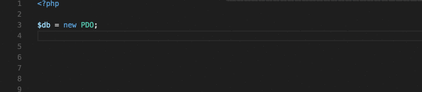
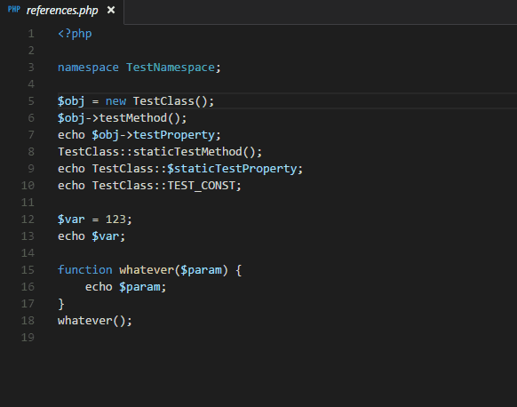

# daysidePHPServer

[](./LICENSE) 

daysidePHPServer [Dayside](https://github.com/boomyjee/dayside) plugin based php-language-server for vscode.  
Should be used with [Monaco](https://microsoft.github.io/monaco-editor/) editor only.


## Features
- code completion  


- go to definition  


## Installation
- Clone the repo with the plugin into the folder near `dayside` folder.
- Go to `server` directory and execute command `composer install`. 
- Connect the plugin to dayside as usual. See example

```html
<!-- connect dayside script -->
<script src="client/dayside.js"></script>
<link href="client/dayside.css" rel="stylesheet" type="text/css">

<!-- connect php_autocomplete script -->
<script src="<plugin_folder>/client/php_autocomplete.js"></script>

<script>
    // run dayside
    dayside({
        //...dayside options
    });
    // run php_autocomplete plugin
    dayside.plugins.php_autocomplete();({
        port: 8000, // port where backend server should start, default 8000
        wss_port: 8443 // port for websocket connection, default 8443
    });
</script>
```
Server will start automatically when you open dayside

### License

Plugin is [MIT licensed](./LICENSE).
